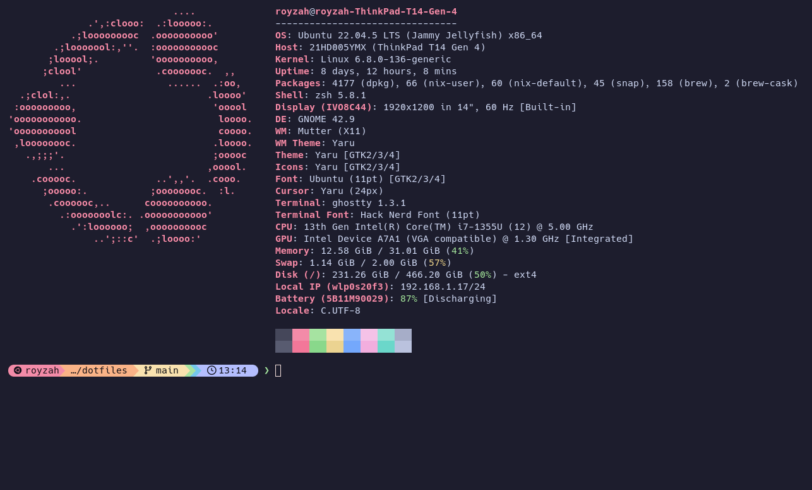

# Dotfiles

A keyboard-first dev environment for embedded, DevOps, and multi-language work.

**Stack:** Ubuntu | Nix | Docker | Ghostty | zsh + Starship | Neovim (LazyVim) | tmux | direnv | fzf + fd + ripgrep + delta | Claude Code



- [Philosophy](#philosophy) - [Fresh Install](#fresh-install) - [Structure](#structure) - [Hardware](#hardware)
- [Workflows](#workflows) - [Claude Code](#claude-code) - [Shortcuts](#shortcuts) - [Omarchy Map](#omarchy-map)
- [Optional Extras](#optional-extras) - [Aliases](#aliases) - [mise](#mise) - [Neovim](NVIM_GUIDE.md) - [Windows](WINDOWS_GUIDE.md)

## Philosophy

Three layers, each doing what it is good at:

- **Ubuntu** owns the desktop, drivers, browser, Docker engine, and hardware tools.
- **Nix** owns language runtimes, compilers, and per-project CLI tools via `flake.nix`.
- **Docker** owns databases, brokers, caches - anything stateful and disposable.

| Put in Nix                     | Keep on Ubuntu              | Put in Docker     |
| ------------------------------ | --------------------------- | ----------------- |
| Python, Node, Rust, Go, Java   | Docker engine               | PostgreSQL        |
| C/C++ toolchains, cmake, ninja | Browser                     | Redis             |
| protobuf/protoc                | VS Code / Neovim config     | SeaweedFS (S3)    |
| jq, yq, just, ripgrep, fd      | GUI apps                    | Mosquitto / NATS  |
| terraform, kubectl, helm, k9s  | Hardware flashing/debuggers | Kafka             |
| linters, formatters            | Vendor SDKs, serial tools   | Anything stateful |

Daily loop: `cd` a project, direnv loads its Nix shell, `docker compose up -d`
brings up services, you code on the host.

## Fresh Install

Ubuntu 26.04 LTS (24.04 works; 22.04 needs the [tree-sitter](#tree-sitter-2204)
step). Every script is idempotent - rerun any of them safely.

```bash
git clone https://github.com/royzah/dotfiles.git ~/Code/dotfiles && cd ~/Code/dotfiles
./bootstrap.sh                  # every tool, then log out and back in
./install.sh && ./setup-system.sh
just gpu && just tune           # graphics + kernel tuning, then reboot
```

The steps below expand on that and cover signing in.

### 1. SSH key

The gitconfig signs commits with `~/.ssh/id_ed25519`, so restore or create it first:

```bash
ssh-keygen -t ed25519 -C "royzah@gmail.com" -f ~/.ssh/id_ed25519
cat ~/.ssh/id_ed25519.pub    # add at github.com/settings/keys (auth AND signing)
```

### 2. Bootstrap

`./bootstrap.sh` installs everything automatable - apt base, zsh + oh-my-zsh,
Nix + nix-direnv, Docker, Neovim, VS Code, Homebrew CLI tools, mise runtimes,
rustup, Claude Code, TPM. Desktop packages are skipped on WSL. **Log out and
back in** afterwards for the default shell and docker group.

### 3. Symlink and configure

```bash
./install.sh         # symlink every config, install VS Code extensions
./setup-system.sh    # font, Ghostty, GNOME keys, extensions, web apps, wallpapers
git remote set-url origin git@github.com:royzah/dotfiles.git
```

Existing files are backed up as `.bak`. `setup-system.sh` exits cleanly on WSL,
headless servers, and non-GNOME desktops.

### 4. Hardware

```bash
just hw        # show what was detected, changes nothing
just gpu       # driver + Vulkan + VA-API for the GPUs present
just tune      # zram, journald cap, writeback, cgroups, CPU scaling + EPP
sudo reboot    # required for kernel cmdline, modeset, and zram
```

`just gpu` picks the stack per vendor and handles hybrid laptops with PRIME
offload; `just tune` sets the right pstate driver and an EPP suited to the
chassis. Details in [Hardware](#hardware). After the reboot, sanity-check:

```bash
just hw                       # driver should read amd-pstate-epp on AMD
vulkaninfo --summary | head
echo $XDG_SESSION_TYPE         # expect: wayland
```

### 5. Sign in

```bash
claude    # /login, then trust ~/Code/dotfiles once
nvim      # lazy.nvim auto-installs; then :Lazy sync, :Mason
tmux      # prefix + I installs plugins
systemctl --user enable --now tmux.service claude-remote.service
```

Optional: `atuin login` (history sync) and Tailscale
(`curl -fsSL https://tailscale.com/install.sh | sh && sudo tailscale up --ssh`).

### 6. Secrets

```bash
touch ~/.secrets.env && chmod 600 ~/.secrets.env    # auto-sourced, never committed
```

Backups read `RESTIC_REPOSITORY` and `RESTIC_PASSWORD` from here - see
[Optional Extras](#optional-extras).

### 7. Carry over from the old machine

The repo restores config; this data is not in git and must be copied manually:

```text
~/.ssh/          keys, plus config.local for work hosts
~/.secrets.env   work env vars, API keys
~/.kube/config   cluster credentials
~/.aws/          cloud credentials
~/.zsh_history   shell history (or use atuin sync)
~/Code/          the actual work
```

Work SSH hosts go in `~/.ssh/config.local` (chmod 600), which the tracked
`ssh_config` includes - that keeps employer infrastructure out of this repo
while `ssh <alias>` still works, and restic backs it up. Lock down with
`sudo ufw enable` (Tailscale SSH bypasses it).

### No sudo (shared servers, work machines)

`./bootstrap-user.sh` installs everything into `$HOME` without root: static zsh
if missing, oh-my-zsh, and every CLI tool as a prebuilt binary via mise
(`mise-cli.toml`). Add `--work` on a machine where company policy applies:
Copilot replaces Claude in tmux, zsh, and Neovim. Then `./install.sh` as usual.
The Windows laptop + remote build server setup is in
[WINDOWS_GUIDE.md](WINDOWS_GUIDE.md).

### tree-sitter (22.04)

Prebuilt binaries need GLIBC 2.39+ (24.04+ has it). On 22.04, build from source
instead of npm/Mason:

```bash
sudo apt install -y libclang-dev && cargo install tree-sitter-cli
```

### WSL2

The shell, editor, and toolchain work; the desktop layer does not exist there.
`bootstrap.sh` and `install.sh` detect WSL and skip the GUI parts, and
`setup-system.sh` exits with an explanation.

| Works                               | Not applicable (Windows owns it)  |
| ----------------------------------- | --------------------------------- |
| zsh, starship, atuin, fzf, zoxide   | GNOME hotkeys, shell extensions   |
| Neovim + LazyVim + claudecode.nvim  | Ghostty (use Windows Terminal)    |
| tmux and its popups                 | web apps, wallpapers, compose key |
| git, delta, lazygit, minicom        | Flameshot, capture.sh, Diodon     |
| Nix flakes, direnv, mise, Docker    | Solaar (needs usbipd-win for USB) |
| Claude Code, MCP, hooks, statusline | gaming, system-tune.sh            |

Three things that matter more than any config here:

1. Keep repos in `~/Code`, never `/mnt/c/...` - crossing the filesystem boundary
   is far slower. The zshrc warns when the shell starts inside `/mnt`.
2. Enable systemd in `/etc/wsl.conf` (`[boot]`, `systemd=true`), or the timers
   cannot run.
3. Install a Nerd Font on the Windows side, or the starship prompt renders as
   boxes.

Clipboard is bridged: `pbcopy`/`pbpaste`/`xclip` map to `clip.exe` and
`powershell.exe Get-Clipboard`, and `open` maps to `explorer.exe`.

## Structure

```text
dotfiles/
|-- bootstrap.sh           # fresh-machine installer (idempotent)
|-- bootstrap-user.sh      # no-sudo installer for servers (--work: Copilot)
|-- install.sh             # symlink installer (backs up existing)
|-- setup-system.sh        # font, ghostty, GNOME keys, systemd
|-- justfile               # task runner: just install / system / update / ...
|-- zshrc                  # aliases, nix/embedded/k8s/docker functions
|-- starship/ tmux.conf ghostty/ nvim/ lazygit/    # editor + terminal
|-- gitconfig gitignore_global ssh_config direnvrc # dev config
|-- mise.toml gdbinit minirc.* XCompose            # runtimes, debug, serial, compose
|-- claude/                # Claude Code global config
|-- bin/                   # scripts (see table below)
|-- templates/             # flake.nix, envrc, compose.yaml, CLAUDE.md
|-- migrations/            # run-once machine migrations
|-- systemd/ vscode/ chrome/    # services, editor settings, browser policy
```

### just targets

| Command                             | What it does                                                  |
| ----------------------------------- | ------------------------------------------------------------- |
| `just install`                      | Symlink all configs, install VS Code extensions               |
| `just system`                       | GNOME settings, keybindings, extensions, web apps, wallpapers |
| `just zsh` / `git` / `ssh` / `nvim` | Link one config group only                                    |
| `just update`                       | apt, brew, mise, rustup, claude, nvim, tpm, nix gc            |
| `just gpu` / `just tune`            | Graphics stack / one-time system tuning                       |
| `just gaming`                       | steam, lutris, heroic, gamemode, mangohud, gamescope          |
| `just clean`                        | Report reclaimable disk (`clean-all` deletes aggressively)    |
| `just backup`                       | Run a restic backup now                                       |
| `just wallpapers <q> [n]`           | Fetch wallpapers into a topic folder                          |
| `just firmware`                     | fwupdmgr refresh and update                                   |
| `just lint` / `just fmt`            | shellcheck, shfmt, luacheck, stylua, markdownlint             |

### bin/ scripts

| Script                      | Purpose                                                 |
| --------------------------- | ------------------------------------------------------- |
| `gpu-setup.sh`              | Driver, Vulkan, VA-API for the GPUs present             |
| `gaming-setup.sh`           | Steam, Lutris, Heroic, GameMode, MangoHud, ProtonUp-Qt  |
| `hw-profile.sh`             | Hardware and session detection, sourced by the others   |
| `system-tune.sh`            | zram, journald cap, writeback limits, cgroup delegation |
| `reclaim.sh`                | Report and free caches + stale build dirs               |
| `backup.sh`                 | restic backup / restore / snapshots                     |
| `capture.sh`                | OCR, QR decode, color pick to clipboard                 |
| `toggle.sh`                 | Do not disturb, night light, stay awake                 |
| `remind.sh` / `bg.sh`       | Countdown notification / cycle wallpaper                |
| `wallfetch.sh`              | Download wallpapers from wallhaven by topic             |
| `webapp-install.sh`         | Turn a URL into a `chrome --app` desktop entry          |
| `hotkeys-overlay.sh`        | Searchable hotkey list (`Super+K`)                      |
| `dl-video.sh` / `db.sh`     | yt-dlp the clipboard / local postgres + redis           |
| `migrate.sh`                | Run once-per-machine migrations                         |
| `nix-init.sh`               | Scaffold flake.nix + .envrc in a project                |
| `tmux-sessionizer.sh`       | zoxide project session picker (`prefix+p`)              |
| `claude-remote.sh`          | Claude Code remote control session                      |
| `gnome-extensions-setup.sh` | Install and configure GNOME extensions                  |
| `dotf.sh`                   | Run any just target from anywhere (`dotf`)              |
| `ai.sh`                     | Claude, or Copilot on a work machine (`cc`, `prefix+a`) |

[Renovate](https://docs.renovatebot.com) watches `templates/compose.yaml`,
`mise.toml`, and `.github/workflows/` and opens grouped version-bump PRs on
Mondays. Enable once by installing the Renovate GitHub app on this repo.

## Hardware

Nothing hardware-specific runs unconditionally. `bin/hw-profile.sh` is sourced
by the setup scripts and runs standalone (`just hw`) to print what it detected:

| Gate                                | True when                                                     |
| ----------------------------------- | ------------------------------------------------------------- |
| `is_laptop` / `is_desktop`          | a battery / DMI chassis is present (else not-laptop, not-WSL) |
| `is_wsl`                            | `WSL_DISTRO_NAME` set or microsoft in `/proc/version`         |
| `has_nvidia`                        | an NVIDIA VGA/3D controller on the PCI bus                    |
| `has_amd_cpu` / `has_intel_cpu`     | `/proc/cpuinfo` vendor                                        |
| `is_wayland` / `is_x11` / `has_gui` | `XDG_SESSION_TYPE`                                            |
| `has_serial`                        | a `/dev/ttyUSB*` or `/dev/ttyACM*` is present                 |

Those gates decide battery readout and light sensor (laptop), persistent CPU
EPP (desktop), the pstate driver (per CPU vendor), the GPU stack and
`environment.d` file (per GPU vendor), Wayland vars and the gaming stack (GUI),
and the serial readout in `just hw`.

### Wayland

The desktop is Wayland-native with X11 fallbacks:

- clipboard: `wl-copy`/`wl-paste`, falling back to `xclip`, then `clip.exe`
- capture: `grim`+`slurp`, then the GNOME Screenshot D-Bus API, then flameshot (X11)
- color picker: `hyprpicker`, then `gpick`/`xcolor`
- window activation: GNOME on Wayland, `wmctrl` on X11

`environment.d/40-wayland.conf` (linked on any GUI machine) sets
`ELECTRON_OZONE_PLATFORM_HINT=auto` for crisp Electron apps on HiDPI, plus
`MOZ_ENABLE_WAYLAND` and a Qt fallback chain.

### Graphics and CPU

`just gpu` dispatches per vendor and enables i386 for Steam:

| Vendor | Stack                                                                                                   |
| ------ | ------------------------------------------------------------------------------------------------------- |
| NVIDIA | `nvidia-driver-580` (LTS), `nvidia-vaapi-driver`, `nvidia-drm modeset=1`, VRAM preserved across suspend |
| AMD    | Mesa + RADV Vulkan, `radeonsi` VA-API/VDPAU, 32-bit halves                                              |
| Intel  | Mesa + Vulkan, `iHD` media driver, 32-bit halves                                                        |

Override the NVIDIA branch with `NVIDIA_BRANCH=595 ./bin/gpu-setup.sh`. On
**hybrid graphics** it sets PRIME offload instead of a session-wide GBM backend
(which would break the desktop), so `prime-run <command>` runs one program on
the dGPU.

`just tune` sets `amd_pstate=active` on the AMD kernel cmdline (grub backed up
first; Intel is already active), then persists an `energy_performance_preference`
of `balance_performance` on desktops and `balance_power` on laptops. Override
with `EPP=performance just tune`.

## Workflows

### Per-project

```bash
cd ~/Code/new-project
nix-init.sh               # copies flake.nix + .envrc from templates
vim flake.nix             # uncomment needed packages
direnv allow              # tools appear on cd, vanish on leave

cp ~/Code/dotfiles/templates/compose.yaml . && docker compose up -d   # optional services
ccinit                    # optional: CLAUDE.md from template, git-excluded
```

`.envrc` is `use flake` (Nix shell, cached by nix-direnv) or `use mise` (quick scripts).

### Nix and embedded

```bash
# Build
nbuild <attr>             # nix build .#<attr>, verbose (extra args pass through)
nbuild_a64 <pkg>          # build for aarch64-linux
lsresult / treeresult / sizeresult

# Serial
serial [baud]             # fzf port picker, default 115200
mcomusb 0 / mcomacm 0     # quick connect by port number
lsserial                  # list serial devices

# Device transfer
todev / fromdev user@dev:/p file   # scp to / from device
ssht user@host                     # ssh + auto-attach tmux
```

More Nix helpers (flake, build, format, store) live in the zshrc: `flakeshow`,
`upinput`, `nixdev`, `nixfmt*`, `nixlint*`, `nixgc`, `qsize`/`qclosure`, and so on.

## Claude Code

The default personal AI tool here; work machines use Copilot via `ai.sh`.
Claude global config is versioned in `claude/`:

| What           | Command  | Alias    | Notes                           |
| -------------- | -------- | -------- | ------------------------------- |
| Claude Code    | `claude` | `cc`     | OAuth login via /login          |
| Continue       | -        | `ccc`    | resume last session             |
| Remote control | -        | `ccr`    | connect from claude.ai/code     |
| Project init   | -        | `ccinit` | CLAUDE.md template into project |

- `claude/CLAUDE.md` and `settings.json` link to `~/.claude/` (memory, permissions, hooks).
- `claude/statusline.sh`: model | dir | branch | cost.
- `claude/hooks/`: block secret-file writes, auto-format after edits, notify on done.
- Entry points: tmux `prefix + a` popup, `Super+Ctrl+A` window, the
  `anthropic.claude-code` VS Code extension, and `coder/claudecode.nvim` in
  Neovim (`Space a` prefix).

MCP servers (user scope, re-add on a new machine):

```bash
claude mcp add --scope user context7 -- npx -y @upstash/context7-mcp
claude mcp add --scope user playwright -- npx -y @playwright/mcp@latest
claude mcp add --scope user --transport http github https://api.githubcopilot.com/mcp/ \
  --header "Authorization: Bearer $(gh auth token)"
```

### Instructions for other AI assistants

Repository instructions and standalone project templates are available for each assistant:

| Assistant      | Repository instructions           | Project template                            |
| -------------- | --------------------------------- | ------------------------------------------- |
| Claude Code    | `CLAUDE.md`                       | `templates/CLAUDE.md`                       |
| Codex          | `AGENTS.md`                       | `templates/AGENTS.md`                       |
| Gemini CLI     | `GEMINI.md`                       | `templates/GEMINI.md`                       |
| GitHub Copilot | `.github/copilot-instructions.md` | `templates/.github/copilot-instructions.md` |

From a new project's root, copy the template for your assistant (existing files
are preserved):

```bash
cp -n ~/Code/dotfiles/templates/AGENTS.md ./AGENTS.md
cp -n ~/Code/dotfiles/templates/GEMINI.md ./GEMINI.md
mkdir -p .github
cp -n ~/Code/dotfiles/templates/.github/copilot-instructions.md .github/copilot-instructions.md
```

Fill in **Project Context** for the target project. Each template is self-contained;
it does not require `CLAUDE.md`. `ccinit` still copies only the Claude template.
These files provide instructions; they do not install clients or configure accounts.
Keep shared rules in sync across assistant variants when editing them.

Filename conventions: [Codex](https://developers.openai.com/codex/guides/agents-md/),
[Gemini CLI](https://geminicli.com/docs/cli/gemini-md/),
[GitHub Copilot](https://docs.github.com/en/copilot/how-tos/configure-custom-instructions-in-your-ide/add-repository-instructions-in-your-ide).

## Shortcuts

`Super+K` lists every custom hotkey, read live from dconf so it never drifts.

### Desktop - custom (set by setup-system.sh)

| Hotkey                    | Action                                                |
| ------------------------- | ----------------------------------------------------- |
| `Super+K`                 | Hotkeys overlay - searchable list of everything below |
| `Ctrl+Alt+T`              | New Ghostty window                                    |
| `Super+V`                 | Clipboard history (Diodon)                            |
| `Super+Ctrl+E`            | Emoji picker                                          |
| `Super+Ctrl+R`            | Set a countdown reminder                              |
| `Super+Print`             | Pick color from screen -> clipboard                   |
| `Super+Ctrl+Print`        | OCR screen region -> clipboard                        |
| `Super+Shift+Print`       | Decode QR from screen -> clipboard                    |
| `Super+Ctrl+N`            | Toggle night light                                    |
| `Super+Ctrl+Comma`        | Toggle do not disturb                                 |
| `Super+Ctrl+I`            | Toggle stay awake (no screen blank)                   |
| `Super+Ctrl+D`            | yt-dlp the clipboard URL -> ~/Videos                  |
| `Super+Ctrl+Space`        | Next wallpaper                                        |
| `Super+Ctrl+A`            | Claude Code in a dedicated window                     |
| `Super+Ctrl+L`            | Solaar - pair/unpair Logitech devices                 |
| `Super+Shift+W/Y/C/M/X/S` | WhatsApp / YouTube / Claude / Maps / X / Spotify      |

Web apps are `chrome --app` windows with their own launcher and icon. Add more
with `webapp-install.sh <Name> <URL>`.

### Desktop - GNOME built-ins

| Hotkey                    | Action                        |
| ------------------------- | ----------------------------- |
| `Super`                   | Activities / app search       |
| `Super+L`                 | Lock screen                   |
| `Super+W`                 | Close window                  |
| `Super+Up` / `Super+Down` | Maximize / unmaximize         |
| `Super+BackSpace`         | Resize window with arrows     |
| `Shift+F11`               | Toggle fullscreen             |
| `Print`                   | Screenshot UI                 |
| `Alt+Tab` / `Super+Tab`   | Switch windows / apps         |
| `Super+1..6`              | Switch to workspace (6 fixed) |
| `Super+Shift+1..6`        | Move window to workspace      |

### Ghostty

| Hotkey                         | Action                         |
| ------------------------------ | ------------------------------ |
| ``Ctrl+` ``                    | Quick terminal (dropdown)      |
| `Ctrl+Shift+,`                 | Reload config                  |
| `Ctrl+Shift+P`                 | Command palette                |
| `Ctrl+Shift+C` / `V`           | Copy / paste                   |
| `Ctrl+=` / `Ctrl+-` / `Ctrl+0` | Font bigger / smaller / reset  |
| `Ctrl+Shift+F` / `J`           | Search / dump scrollback       |
| `Ctrl+Shift+PageUp/Down`       | Jump to previous / next prompt |
| `Ctrl+Shift+Enter` / `\`       | Split right / down             |
| `Ctrl+Shift+Arrows`            | Focus split                    |
| `Ctrl+Shift+Z` / `E`           | Zoom split / equalize          |
| `Ctrl+Shift+W`                 | Close split or tab             |
| `Alt+1..9`                     | Go to tab                      |

### tmux (prefix = `Ctrl-a`)

| Prefix + key          | Action                                     |
| --------------------- | ------------------------------------------ |
| `\|` / `-`            | Split horizontal / vertical                |
| `h j k l` / `H J K L` | Navigate / resize panes                    |
| `c`                   | New window                                 |
| `Ctrl-h` / `Ctrl-l`   | Previous / next window                     |
| `f` / `p`             | Fuzzy session picker / project sessionizer |
| `a`                   | Claude Code popup                          |
| `g` / `K` / `B` / `N` | lazygit / k9s / btop / nvim popup          |
| `x` / `r`             | Kill pane / reload config                  |
| `[` then `v` / `y`    | Copy mode (vi): select / yank              |
| `F`                   | Thumbs quick-copy (URLs, hashes, paths)    |
| `I` / `U`             | TPM install / update plugins               |

Sessions auto-restore via resurrect + continuum. New to tmux? See
[TMUX_GUIDE.md](TMUX_GUIDE.md).

### zsh

| Key                | Action                                              |
| ------------------ | --------------------------------------------------- |
| `Ctrl-R`           | atuin history search                                |
| `Ctrl-T` / `Alt-C` | fzf file picker / fzf cd                            |
| `Right`            | Accept autosuggestion                               |
| `CapsLock`         | Compose key: `caps m s` emoji, `caps space e` email |

### Neovim (Claude Code)

| Key               | Action                         |
| ----------------- | ------------------------------ |
| `Space ac` / `af` | Toggle / focus Claude terminal |
| `Space ar` / `aC` | Resume / continue session      |
| `Space ab` / `as` | Add buffer / send selection    |
| `Space aa` / `ad` | Accept / deny diff             |

Everything else Neovim: [NVIM_GUIDE.md](NVIM_GUIDE.md).

### GNOME extension keys

| Hotkey          | Action                                           |
| --------------- | ------------------------------------------------ |
| `Super+T`       | Tactile: show tiling grid, then type two letters |
| `Super+Shift+N` | Space Bar: move window to workspace N            |
| `Alt+Space`     | Window menu (Undecorate lives here)              |

`setup-system.sh` installs seven extensions: **Tactile** (keyboard tiling),
**Space Bar** (workspace pills), **Just Perfection** (shell tuning), **Blur my
Shell** (overview), **Vitals** (CPU, memory, network meters), **Undecorate**,
**Alphabetical App Grid**. Settings are written against each extension's own
schema via `gsettings --schemadir`, so nothing lands in `/usr`. Vitals needs
`gir1.2-gtop-2.0` (CPU/memory) and `lm-sensors` (temperatures), both from
`bootstrap.sh`.

### Shell functions

```bash
remind 7 "tea"            # countdown notification (systemd timer)
try <name>                # cd into ~/Work/tries/<date>-<name>
tdl / tsl 4 <cmd>         # tmux layouts: nvim+claude+shell / n panes running cmd
gwa <branch> / gwd        # git worktree add + cd / remove current
watchsync <dir> <host:p>  # rsync to a device on every file change
compress <dir>            # dir -> dir.tar.gz
weather / wifipass / speedtest
webm2mp4 <file>           # webm -> mp4 (h264/aac)
iso2sd <iso> /dev/sdX     # write an iso to a drive, with confirmation
fix_fkeys                 # apple keyboards: F-keys as function keys
db.sh up|psql|redis|down  # throwaway postgres 18 + redis 8 on localhost
dotf <target>             # run any just target from anywhere
```

Migrations follow the same run-once model: drop a script in `migrations/` and
`bootstrap.sh` / `just update` run it exactly once per machine (state in
`~/.local/state/dotfiles/`). `migrate.sh --pending` lists unrun ones; a
migration can request a service restart by touching
`~/.local/state/dotfiles/restart-<service>`. Machine-local steps you do not want
public go in `~/.config/dotfiles/hooks/post-migrate.d/`.

## Omarchy Map

Where each [Omarchy manual](https://omarchy.org/manual/) chapter landed, ported
from Hyprland/Wayland to GNOME. The Quickshell layer (auto-tiling, scratchpads,
the Quickshell bar) has no GNOME equivalent and was skipped.

| Omarchy chapter        | Here on Ubuntu/GNOME                                                |
| ---------------------- | ------------------------------------------------------------------- |
| Navigation             | GNOME workspaces: `Super+1..6`, `Super+[`/`]`, Tactile tiling       |
| The Top Bar            | GNOME bar + Space Bar pills, Vitals meters, clock w/ weekday        |
| Hotkeys                | `Super+K` overlay, read live from dconf                             |
| Themes                 | Catppuccin Mocha fixed everywhere, Chrome via managed policy        |
| Unified Clipboard      | Diodon on `Super+V`                                                 |
| Text Extraction        | `Super+Ctrl+Print` OCR, `Super+Shift+Print` QR                      |
| Screenshots / Toggles  | Flameshot (`Print`), color pick; `toggle.sh` dnd/nightlight/awake   |
| Omarchy CLI            | `dotf <target>` over the justfile                                   |
| Terminal / Neovim / AI | Ghostty + tmux + LazyVim; Claude Code (`Super+Ctrl+A`, popup, nvim) |
| Development Tools      | Nix flakes + direnv, mise, Docker, `db.sh`, gh                      |
| Shell Tools            | starship, atuin, fzf, zoxide, eza + ported functions                |
| TUIs                   | tmux popups + app-grid launchers (btop, lazygit, lazydocker, k9s)   |
| Browsers / Web Apps    | Chrome + 6 `--app` windows with hotkeys                             |
| Updates / Dotfiles     | `just update`, `migrate.sh`, Renovate                               |
| Fonts / Backgrounds    | Hack Nerd Font everywhere, `bg.sh` wallpaper cycling                |

## Optional Extras

### System tuning

```bash
just tune    # zram swap, journald cap, writeback limits, cgroup delegation (needs sudo, once)
```

### Backups (restic to Backblaze B2, daily timer)

```bash
# 1. Create a B2 bucket, then an application key scoped to it (Read+Write). One key per machine.
# 2. Put the credentials in ~/.secrets.env:
#      export RESTIC_REPOSITORY="b2:my-bucket:restic"
#      export RESTIC_PASSWORD="a-long-passphrase"   # also store in Bitwarden
#      export B2_ACCOUNT_ID="keyID"
#      export B2_ACCOUNT_KEY="applicationKey"
# 3. Initialise and schedule:
backup.sh init
systemctl --user enable --now backup.timer
backup.sh snapshots                     # list
backup.sh restore ~/restore-here        # pull the latest back
```

Backs up what exists nowhere else - `~/Documents`, `~/Pictures`, `~/.ssh`,
`~/.kube`, `~/.aws`, `~/.secrets.env`, shell history (~400 MB, inside B2's free
tier). `~/Code` is excluded (mirrored to git), as are wallpapers, build
artifacts, and caches. **The passphrase must live off this machine** (it
encrypts the repo, and `~/.secrets.env` is itself inside the backup) - put it in
Bitwarden.

### Desktop apps

```bash
sudo snap install spotify discord obs-studio slack telegram-desktop signal-desktop \
  bruno dbeaver-ce localsend bitwarden
sudo apt install -y vlc wireshark xournalpp gnome-tweaks gnome-shell-extension-manager
# debs: GitKraken, Chrome, Obsidian; AppImage: Etcher (balena)
```

- **Chrome** is required by the Claude-in-Chrome extension and the web apps.
  Its extensions are force-installed from `chrome/extensions.txt` via managed
  policy - delete a line and rerun `setup-system.sh` to drop one.
- **Bitwarden** ssh-agent can hold your SSH keys, and `bw get password <item>`
  in an `.envrc` replaces plaintext secrets.
- **GitKraken** pairs with the Claude Code gitkraken-hooks plugin.

### Gaming, wallpapers, disk, VPN

```bash
# Gaming: just gaming (step in the justfile) installs the stack; then:
gm <game> / gmhud <game>                # run with GameMode / + FPS overlay
# Steam launch options: gamemoderun mangohud %command% (prefix prime-run on hybrid)
# MangoHud toggles with Shift_R+F12; ProtonUp-Qt manages Proton-GE.
sudo apt install -y retroarch           # extras not in the just target
flatpak install -y flathub io.github.moonlight_stream.Moonlight

# Wallpapers land in ~/Pictures/wallpapers/<topic>/, bg.sh cycles all
just wallpapers "jdm" 40
wallfetch.sh "tokyo neon" 25 japan      # explicit topic folder

# Disk: reclaim developer junk (dry run by default)
just clean / just clean-all             # report / delete (incl. go modcache + docker)
reclaim.sh --days=90                    # only projects idle 90+ days

# NordVPN
curl -sSf https://downloads.nordcdn.com/apps/linux/install.sh | sh
nvon / nvoff / nvstatus                 # connect / disconnect / status
```

## Aliases

The OMZ git plugin provides the standard `g*` aliases. Extras:

```bash
# Navigation
.. / ... / ....           # up 1/2/3
dev / src / docs / dl     # ~/Code ~/src ~/Documents ~/Downloads
z / zi                    # zoxide jump / interactive

# Files
ls / ll / la / lt / ltt   # eza listings and trees
b / v / jl / duu          # bat, nvim, jless, dust

# System
please                    # sudo last command
ports / myip / localip / killport <port>
mkcd / backup / extract / serve / json
ff / fdir / findin        # find file / dir / in contents

# Git
lg / glog                 # lazygit / pretty log graph
git s / last / undo / wip / branches / cleanup

# Docker
d / dps / dpsa / dex / dlog / dstats / dinsp
di / dbuild / dpull / dpush / dprune ; ld   # lazydocker

# Docker Compose
dc / dcup / dcupb / dcdown / dcdownv / dclog / dcps / dcexec / dcrestart

# Kubernetes
k / kk                    # kubectl / k9s
kgp kgd kgs kgn kga kns   # get; kdp/kdd describe; klog/kexec logs/exec
klogs <pattern>           # stern multi-pod tail
kapply kdel kpf krollout krestart ; kctx / kc <ctx> / ksetns <ns>

# Terraform / Rust / Go / Python
tf tfi tfp tfa tfd
cb cbr cr crr ct cck cf cw cdoc   # cargo
gob gor got gota gof goi govet    # go
py pip pipi venv activate pyclean

# Debug / net / VPN
strace-pid <pid> / listening / dns / sniff / headers
vpn / vpnoff / vpnstatus   # openconnect; VPN_HOST/VPN_USER from ~/.secrets.env
```

## mise

```bash
mise ls / install / outdated
mise use node@22          # global
mise use -p python@3.11   # project-local
```
