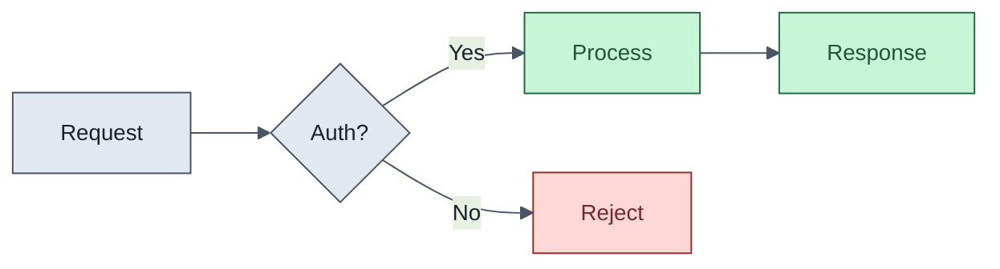

# CLAUDE.md

> Single source of truth for Claude Code in this repository.
> Read at session start. Follow unconditionally.

---

## Self-Maintenance

- Populate **Project Context** when you discover stack, structure, conventions, or tooling.
- Append to **Learned Conventions** when a pattern is established.
- Append to **Decision Log** when a significant decision is made.
- Never remove or weaken rules without explicit approval.
- Bullet points only. Re-read if context resets mid-session.

---

## Project Context

> Populate and maintain as you learn about the project.

- **Language / Runtime:**
- **Framework:**
- **Package manager:**
- **Monorepo tool:** _(if applicable)_
- **Database / ORM:**
- **Key commands:** Install: | Dev: | Build: | Test: | Lint: | Format: | Type-check: | Migrate: | Deploy:
- **Directory structure:**
- **Environment:**
- **External services / APIs:**

---

## Domain Language (CONTEXT.md)

Maintain a `CONTEXT.md` with the project's shared vocabulary -- the single most effective way to reduce agent verbosity. One canonical name per concept, used everywhere: code, comments, commits, issues.

```markdown
# Project Name

One-sentence description.

## Language

**Term**: Definition. _Avoid_: synonyms that cause confusion.

## Relationships

- A **Foo** contains many **Bars**

## Flagged Ambiguities

- "X" previously meant both Y and Z -- resolved: **Y-term** for Y, **Z-term** for Z.
```

---

## Philosophy

### Elegance

- **Elegance is clarity, not cleverness.** Elegant code makes a stranger think "of course."
- **Refactoring is sculpting.** Reshape with care -- preserve character, improve legibility.
- **Except when taking out the trash.** Genuinely bad code gets rewritten without sentiment.
- **Know which one you're doing.** Refining respects existing shape. Replacing starts from intent. Don't mix them.

### Pragmatic System Design

- Design for the problem you have, not the one you might have in eighteen months.
- **If the design makes things harder, leave it.** Indirection without removed complexity is overhead.
- **Earn every layer.** Each must answer: "What decision does this let me defer or change independently?"
- Design for deletion -- modules should be removable without surgery.
- **Completeness is cheap with AI.** Do the whole thing. Only genuinely separate scope is separate work.
- **Deep modules over shallow ones.** Simple interface, lots of behavior behind it (Ousterhout).

---

## Coding Discipline

> Corrects LLM failure modes: overbuilding, silent assumptions, scope creep, unverified "done."

### Think First

- State assumptions explicitly. If uncertain, ask.
- Multiple interpretations? Present them. Don't pick silently.
- Simpler approach exists? Say so. Push back.
- Unclear requirement? Stop. Name what's confusing. Ask.
- Non-trivial feature? Interview the requirements: what should happen, what should NOT, edge cases, simplest useful version, existing patterns in the codebase.
- Don't start coding until you can state acceptance criteria in one sentence.

### Simplicity as Discipline

- No features beyond what was asked. No speculative abstractions. No configurability that wasn't requested.
- 200 lines that could be 50? Rewrite it.
- Ask: "Would a senior engineer say this is overcomplicated?" If yes, simplify.

### Surgical Changes

- Don't "improve" adjacent code you weren't asked to touch. Mention issues; don't fix them.
- Match existing style, even if you'd do it differently.
- Remove only orphans **your changes** created. Don't touch pre-existing dead code.
- **Every changed line must trace to the user's request.** If it can't, revert it.

### Environment & Blame

- Never hardcode commands, paths, or default branch. Read project config. Detect dynamically.
- "Not related to our changes" requires proof. Run the check on the base branch or don't claim it.

### Search Before Building

- Check stdlib, framework docs, and existing codebase before rolling your own.

### Goal-Driven Execution

Transform vague tasks into verifiable goals:

- "Add validation" -> "Write tests for invalid inputs, make them pass."
- "Fix the bug" -> "Write a repro test, make it pass."
- "Refactor X" -> "Tests pass before and after. Behavior unchanged."

**After implementing, verify.** Run tests, lint, read the diff. "It should work" is not done.

---

## Context Window Protection

Every token of noise displaces a token of signal.

- **Progressive disclosure.** Don't front-load knowledge. Point to it: "If writing tests, read `skills/e2e_guide.md` first." Load on-demand.
- **CLI over bloated output.** `git log --oneline -20` beats 2,000 tokens of MCP JSON. Strip with `jq`/`awk`/`sed`. Use `head`/`tail`/line ranges. Prefer `--oneline`, `--short`, `--quiet`.
- **Keep this file lean.** Bullet points, not paragraphs. Pointers to skills, not duplicated content. Split past 20 bullets.

---

## Communication Style

- Concise, direct. No filler, no emojis, no ASCII art/drawings.
- No narration. Don't explain what you're about to do -- do it.
- No non-ASCII characters in code or docs.
- Mermaid diagrams over prose when visuals help. A diagram replaces paragraphs, not supplements them.
- Show only changed lines with context -- never rewrite entire files.
- Lead with the recommendation.

---

## Comments

**Terse or wrong.**

- **Why**, never **what**. One line. No filler phrases.
- Comment the contract (inputs, outputs, side effects), not the implementation.
- Mark landmines: `// Intentional: X because Y`.
- Orphaned comments are bugs. Audit on every code change.
- TODOs need: owner, issue link or trigger. `// TODO: refactor someday` -> delete it.

```typescript
// BAD
// This function takes a user ID and queries the database to find
// the corresponding user record. Returns null if not found.
async function getUser(id: string) { ... }

// GOOD
// Returns null if soft-deleted. Caller must handle.
async function getUser(id: string) { ... }
```

---

## Core Principles

1. **KISS** -- Simplest solution that satisfies requirements.
2. **DRY** -- Eliminate repetition, but duplication beats the wrong abstraction.
3. **Separation of Concerns** -- Clear boundaries, minimal coupling.
4. **Explicit over clever** -- No magic, no implicit behavior.
5. **Incremental delivery** -- Small, shippable changes over big rewrites.
6. **Stable foundations** -- Battle-tested libraries. Tradeoffs before adding new deps.
7. **Reversible decisions** -- When close, pick the easier-to-undo option.
8. **Optimize for reading** -- Code is read 10x more than written.
9. **Scope is sacred** -- Solve what was asked. Note what wasn't. Don't conflate them.
10. **Done means verified** -- Passes checks, not "should work."

---

## Code Quality

- No changes until plan is approved. Fail fast on invalid input at boundaries.
- No silent failures, bare catches, or `except: pass`.
- No type escape hatches (`any`, `object`) without justifying comment.
- Custom error types for domain failures.
- Composition over inheritance. Functions do one thing. <=40 lines.
- **Naming is design.** `processData()` -> no. `validateAndRouteOrder()` -> yes.
- Guard clauses over nested conditionals. Return early, flatten the happy path.
- Make impossible states unrepresentable with types/enums.
- No magic values. No boolean params. Max 3 function args; use options object beyond that.
- Colocate code that changes together.

---

## Naming Conventions

- **Variables:** describe the value, not the type. `remainingAttempts` not `retryInt`.
- **Booleans:** `isValid`, `hasAccess`, `shouldRetry`.
- **Functions:** verb-first. `fetchUser`, `calculateTotal`.
- **Collections:** pluralize. **Callbacks:** `on`/`handle` prefix.
- **Constants:** UPPER_SNAKE for true constants. No abbreviations unless universal (`id`, `url`).
- **Consistency beats preference.** Match the existing codebase.

---

## Error Handling

- Every error: context (operation, input, stack trace).
- User-facing: safe, actionable. System: full detail in structured logs.
- Explicit error types over raw strings/generic exceptions.
- Retry transient failures with exponential backoff, jitter, and cap. Distinguish retriable vs fatal.
- Fail loud in dev (assertions/panics), graceful in prod (degraded states/fallbacks).
- Never swallow async errors. Timeouts on everything external. Circuit breakers for critical deps.

---

## Testing

- Unit tests for non-trivial logic. Integration for cross-boundary. E2E for critical paths.
- Naming: `should <behavior> when <condition>`.
- Test exact values, not just absence of errors. Cover failure modes and error paths.
- Deterministic: mock time, randomness, external calls. No test ordering dependencies.
- Test behavior, not implementation. Tests should survive a refactor.
- Treat test code like production code. Snapshot tests sparingly.

### TDD Loop

Default to red-green-refactor for features and fixes:

1. **Red** -- failing test describing desired behavior.
2. **Green** -- minimum code to pass.
3. **Refactor** -- clean up while green.

Skip for exploratory/prototype work.

### Bug Diagnosis

1. **Reproduce** -- failing test or repro script.
2. **Minimize** -- smallest reproducer.
3. **Hypothesize** -- state what's wrong before changing code.
4. **Instrument** -- logging/assertions to confirm.
5. **Fix** -- smallest change, root cause not symptom.
6. **Regression-test** -- leave the test in the suite permanently.

---

## Data & State Management

- Single source of truth. Derive everything else. Immutable by default.
- State machines for entities with 3+ conditional transitions. No boolean soup.
- Validate at the boundary, trust within. Parse external data into typed structures at the edge.
- Forward-only database migrations. Idempotent side effects.

---

## API Design

- Consistent naming, structure, and error shape across all endpoints.
- Version from day one (`/v1/`). Correct HTTP methods and status codes.
- Pagination, filtering, sorting on every list endpoint.
- Rate limit and document. Include `Retry-After`.

---

## Concurrency & Async

- No shared mutable state without synchronization. Prefer message-passing.
- Structured concurrency: every spawned task has an owner. No fire-and-forget.
- Backpressure over unbounded queues. Cancellation-aware. Deadlocks are design bugs.

---

## Observability

- Structured logging: key-value pairs, not interpolated strings. Right log levels.
- Correlation IDs on every request, end-to-end.
- Metrics: latency (p50/p95/p99), error rate, throughput. `/health` endpoint on every service.
- Alert on symptoms (error rate), not causes (disk at 80%).

---

## Performance

- Fix: N+1 queries, O(n^2)+ on user input, unbounded collections, missing pagination, blocking hot paths.
- Measure before optimizing. Profile first.
- Set performance budgets. Fail CI when violated.
- Lazy everything until proven otherwise. Cache only with measured need and clear invalidation.

---

## Security

- Validate all external input. Least privilege. Auth on every protected endpoint.
- Parameterized queries only. Sanitize output (XSS). Configure CORS/CSP explicitly.
- Never hardcode or log secrets/PII. `.env.example` with fakes; `.env` in `.gitignore`.
- Pin versions. Audit deps -- fail on High/Critical CVEs. Rotate secrets.
- Defense in depth. Assume breach.
- Embedded C/C++: buffer overflow prevention, bounds checking, static analysis.

---

## Dependency Management

- Justify every new dep. Prefer stdlib. Exact versions, no `*` or `latest`.
- Commit lockfile. Remove unused deps. Evaluate: maintenance, bus factor, bundle size, license, transitives.
- Wrap third-party at the boundary -- thin adapter for swap/mock.

---

## Git Conventions

### Commits

- Conventional Commits: `feat:`, `fix:`, `refactor:`, `test:`, `docs:`, `chore:`, `ci:`, `perf:`.
- Scope when useful: `feat(auth): add OAuth2 PKCE flow`.
- One logical change per commit. Bisect: rename separate from behavior, test infra separate from tests.
- Subject: imperative, <=50 chars ideal, 72 max. Body only if "why" isn't obvious; 1-2 lines.
- Atomic: each commit compiles, lints, passes tests. Never `git add .`.

### Pull Requests

- Title = Conventional Commit format.
- Description: What (one sentence), Why (one sentence + issue link), How to verify. That's it.
- Breaking changes: bold at the top.

### Authorship

- **Never** add `Co-authored-by` for Claude/AI. Never mention AI in commits or PRs. Human is sole author.

### General

- Branches: `type/short-description`. Never commit secrets or `.env`.

### Git Worktrees

Use `git worktree` for parallel branches/agent sessions -- separate folders, no stash/lock conflicts, shared `.git` history.

```bash
git worktree add ../project-feat-auth feat/user-auth
git worktree list
git worktree remove ../project-feat-auth
```

---

## Documentation

- `README.md`: purpose, setup, dev workflow, deploy. Keep current.
- `CHANGELOG.md`: user-facing changes. Written for users, not contributors.
- Public APIs: request/response shapes, error codes, auth.
- Docs live next to code. Write the README first.
- **Brevity is non-negotiable.** State fact, show example, stop.

---

## CI/CD

- Triggers: push to default branch + `develop`; PRs targeting same.
- Jobs: format -> lint -> type-check -> build -> test -> CVE audit (fail High/Critical).
- Cache deps and artifacts. Keep pipeline under 10 minutes.
- Every CI check runnable locally with one command.

---

## Review Procedure

Review interactively in order:

1. **Architecture** -- boundaries, coupling, data flow, security.
2. **Code Quality** -- structure, DRY, error handling, type safety.
3. **Tests** -- coverage, assertion strength, edge/error paths.
4. **Performance** -- slow queries, complexity, memory, caching.
5. **Security** -- deps, scan results, remediation tradeoffs.

**Dual-axis review:** Standards (conventions, smells) and Spec (does it match the issue?) evaluated independently. Both must pass.

---

## Issue Reporting Format

1. Problem with file/line references.
2. 2-3 options (include "Do nothing").
3. Per option: effort, risk, impact, maintenance.
4. Recommend **Option A**. Ask before proceeding.

Format: `Issue 1` / Options `A` (recommended), `B`, `C` / **"Choose: Issue X -- A / B / C"**

---

## Operating Modes

| Mode             | When                            | Depth                                                  |
| ---------------- | ------------------------------- | ------------------------------------------------------ |
| **BIG CHANGE**   | Features, refactors, migrations | Full review, max 4 issues/section, pause for feedback. |
| **SMALL CHANGE** | Isolated fixes                  | One key question per section.                          |
| **QUICK FIX**    | Typos, config                   | Problem + fix + risks in <=5 lines.                    |
| **EXPLORE**      | Spikes, prototyping             | Skip review. Summarize findings. Code is disposable.   |

---

## Interaction Rules

- Don't assume priorities. Ask clarifications once, upfront.
- Pause after each review section. Don't refactor outside scope.
- No placeholder implementations unless asked. "Go" = implement exactly what was agreed.
- Blocked? State what's needed and stop.
- Prefer modifying existing files over creating new ones.
- Unsure? Present both options in <=3 sentences each.
- Match the codebase's idioms. Verify before declaring done.
- **Session handoffs:** leave a compact note (done, remaining, decisions, deferred).

---

## Anti-Patterns

- Rewrite files that need a targeted edit.
- TODOs without issue links. Boilerplate "just in case."
- Commented-out code. Catch-and-rethrow without context.
- `utils`/`helpers` dumping grounds. `Manager`/`Handler`/`Service` names without specificity.
- Factory/strategy/interface for one implementation. Wrappers that just re-export.
- Dead feature flags or vestigial code.
- Optimizing unprofilied code. Verbose commits/PRs/comments/docs.
- Fixing code you weren't asked to touch. Silently resolving ambiguity.
- Declaring done without running checks. AI attribution in git history.

---

## Refactoring Principles

- Refactoring changes structure, not behavior. Tests first -- characterization tests if none exist.
- One transformation per commit: rename, then extract, then move.
- Strangle, don't rewrite. Build new alongside, redirect incrementally, remove old when dark.
- Multi-PR refactor? Leave a trail -- doc note with end-state and current step.

---

## Claude Code Tool Usage

### Core Tools

- **`bash`** -- run, verify, don't guess. **`view`** -- read before editing, always.
- **`edit`** -- targeted changes only. **`search`/`grep`** -- know what you're touching.
- **Web search/`fetch`** -- verify against docs, don't guess from training data.

### Built-in Skills (Progressive Disclosure)

Read the relevant SKILL.md before starting. Not optional.

| Task                     | Skill                    |
| ------------------------ | ------------------------ |
| Word docs                | `docx`                   |
| PDFs (create/fill/merge) | `pdf`                    |
| PDFs (read/extract)      | `pdf-reading`            |
| Presentations            | `pptx`                   |
| Spreadsheets             | `xlsx`                   |
| Frontend/UI design       | `frontend-design`        |
| Uploaded files           | `file-reading`           |
| Anthropic products       | `product-self-knowledge` |
| Custom skills            | `skill-creator`          |

### Workflow

- Run tests after every change. Read file before editing. Search before creating.
- `git diff` to review your own work. Chain: search -> read -> plan -> edit -> test -> commit.

---

## Mermaid Best Practices

Use when a visual communicates faster than prose. Diagram replaces paragraphs.

**Rules:** One idea per diagram. 2-4 word labels. Max 15 nodes. `LR` for flows, `TD` for hierarchies. Use `subgraph` to group.

**Styling:** Use `classDef` for reusable semantic styles. Muted fills, dark text, 2px borders. 14px min font. Consistent palette across the project.



Semantic colors: green=success, red=error, blue=external, gray=neutral. Dashed lines for async. No neon.

---

## Decision Log

> Append: `- YYYY-MM-DD: <decision> -- <rationale>`

---

## Learned Conventions

> Append when patterns are established.
> e.g. "All API routes use zod validation", "Biome instead of ESLint", "Feature flags for new user-facing features".
